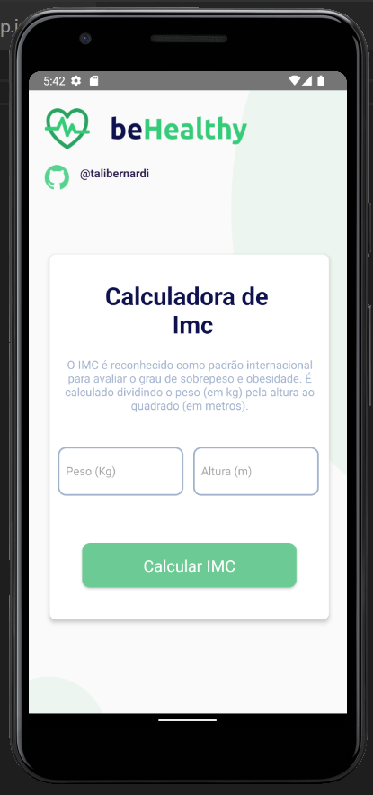

<h1>✨ Calculadora IMC BeHealthy<h1>

<h2>💻 Projeto</h2>
  
IMC é a sigla para Índice de Massa Corpórea, parâmetro adotado pela Organização Mundial de Saúde para calcular o peso ideal de cada pessoa.
   O índice é calculado da seguinte maneira: divide-se o peso do paciente pela sua altura elevada ao quadrado.

  
  <h2>✨ Tecnologias</h2>
<ul class="contains-task-list">
<li class="task-list-item"><input type="checkbox" id="" disabled="" class="task-list-item-checkbox"> React Native </li>
<li class="task-list-item"><input type="checkbox" id="" disabled="" class="task-list-item-checkbox"> JavaScript</li>
</ul>
